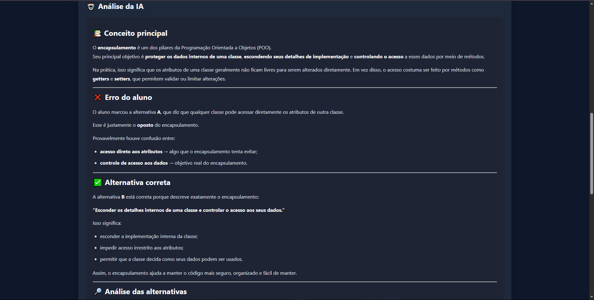
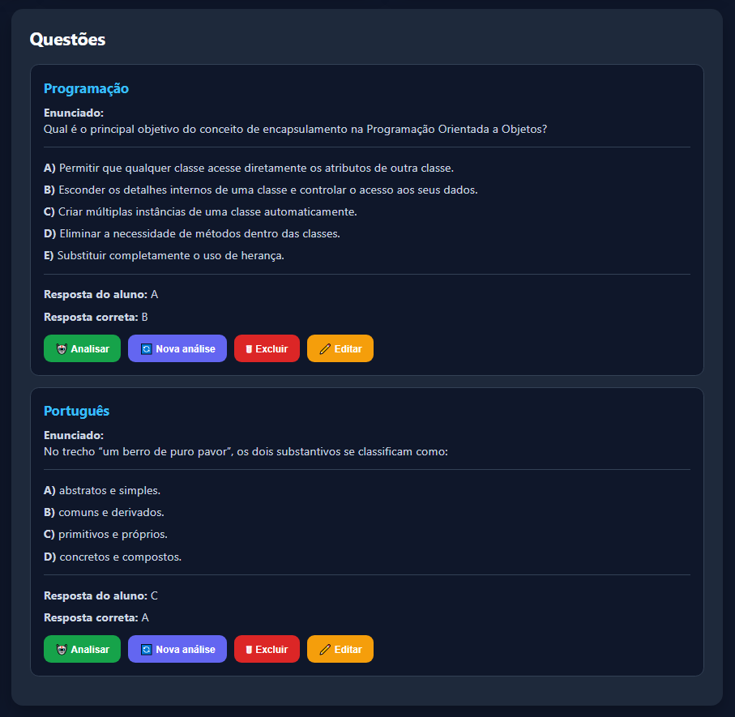
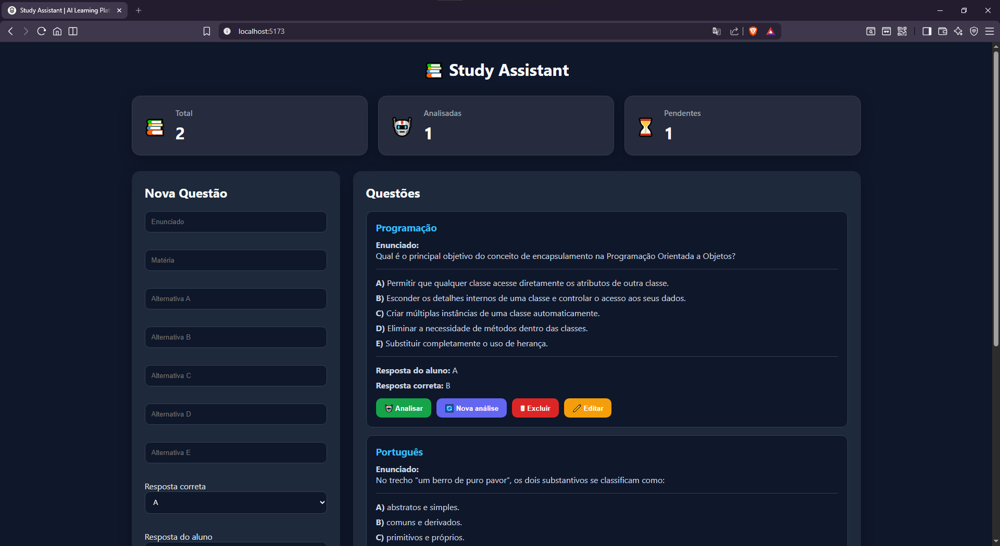
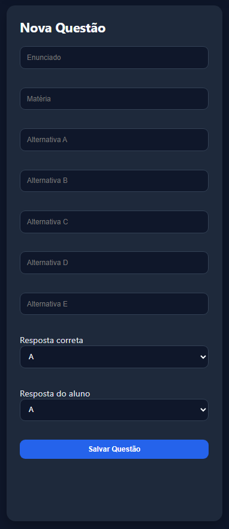
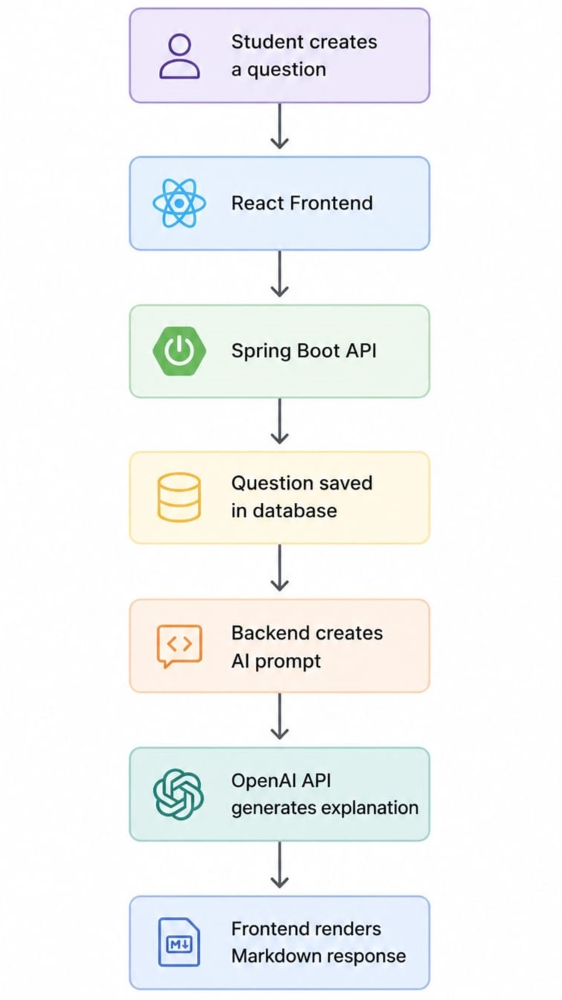

# 📚 Study Assistant

<p align="center">
  AI-powered study assistant that transforms mistakes into personalized learning.
</p>

<p align="center">
  
  
  
  
  
</p>
---

# 🎯 Purpose

Study Assistant was created to transform mistakes into learning opportunities.

Instead of simply informing students whether an answer is correct or incorrect, the application helps them understand **why** they made a mistake by providing contextual explanations generated by AI.

The project combines a modern React frontend, a Spring Boot backend, database persistence, and the OpenAI API to create a personalized study experience.

---

# ✨ Features

## 🤖 AI-Powered Question Analysis

The application sends the student's question, selected answer, and correct answer to the AI service.

The generated explanation includes:

- Explanation of the correct answer
- Explanation of why the selected answer is incorrect
- Analysis of every alternative
- Study recommendations related to the topic



---

## 📝 Question Management

Users can:

- Create questions
- Edit existing questions
- Delete questions
- Manage multiple-choice alternatives
- Store both the correct and selected answers



---

## 📖 Markdown Rendering

AI responses are rendered using Markdown, improving readability with:

- Headings
- Lists
- Emphasis
- Well-structured explanations

---

# 🖼 Application Preview

## 🏠 Home



---

## ➕ Create a Question



---

## 🤖 AI Analysis


---

# 🏗 Architecture

The backend follows a layered architecture:

- Controller Layer
- Service Layer
- Repository Layer
- DTOs
- Entity Mapping
- Flyway Migrations

### Application Flow

```
Student creates a question
          │
          ▼
React Frontend
          │
          ▼
Spring Boot REST API
          │
          ▼
Question saved in database
          │
          ▼
Backend builds AI prompt
          │
          ▼
OpenAI API
          │
          ▼
Markdown response returned
          │
          ▼
React renders formatted explanation
```



---

# 🛠 Tech Stack

## Backend

- Java 21
- Spring Boot
- Spring Web
- Spring WebFlux
- Spring Data JPA
- Flyway
- H2 Database
- OpenAI API

## Frontend

- React
- Vite
- Axios
- React Markdown

---

# 📂 Project Structure

```
Study-Assistant-Project
│
├── study-assistant
│   └── Spring Boot REST API
│
└── study-assistant-front
    └── React Application
```

---

# ✅ Requirements

Before running the project, make sure you have installed:

- Java 21+
- Maven
- Node.js 20+
- npm

You will also need an OpenAI API key.

---

# 🚀 Running Locally

## Clone the repository

```bash
git clone https://github.com/YOUR_USERNAME/YOUR_REPOSITORY.git
```

---

## Backend

Navigate to the backend folder:

```bash
cd study-assistant
```

Configure your OpenAI API key as an environment variable:

```text
API_KEY=your_openai_api_key
```

Run the application:

```bash
./mvnw spring-boot:run
```

---

## Frontend

Navigate to the frontend folder:

```bash
cd study-assistant-front
```

Install dependencies:

```bash
npm install
```

Start the development server:

```bash
npm run dev
```

The application will be available at:

```
http://localhost:5173
```

---

# 📌 Current Features

- ✅ Full Question CRUD
- ✅ AI-powered answer explanations
- ✅ Multiple-choice question support
- ✅ Markdown rendering
- ✅ Spring Boot REST API
- ✅ React frontend
- ✅ OpenAI API integration
- ✅ Analysis regeneration

---

# 🔮 Future Improvements

- JWT Authentication
- PostgreSQL support
- Docker containerization
- User accounts
- Study history
- Subject filtering
- Search functionality
- AI-generated flashcards
- Spaced repetition
- AI-generated quizzes
- PDF import and question extraction

---

# 📚 What I Learned

Throughout this project, I strengthened my knowledge of:

- REST API development with Spring Boot
- Layered Architecture
- DTOs and object mapping
- JPA entity relationships
- Flyway database migrations
- External API integration
- Spring WebClient
- Prompt engineering
- React fundamentals
- State management with Hooks
- Frontend and backend integration
- Markdown rendering
- Software architecture principles

---

# 👨‍💻 Author

Developed by **Francisco Gendesson Alves**

If you found this project interesting, feel free to connect with me.

- LinkedIn: [www.linkedin.com/in/gendesson-alves](https://www.linkedin.com/public-profile/settings/?lipi=urn%3Ali%3Apage%3Ad_flagship3_profile_self_edit_contact_info%3BopAEsW%2FlQTCbU%2FcvFvAAjw%3D%3D)
- GitHub: [https://github.com/GendessonSousa](https://github.com/GendessonSousa)
